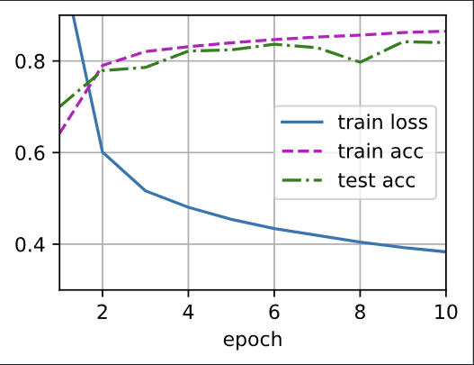

# RE0:MLP
## 记录一下当调参虾的结果
* $epoch=10,lr=0.1,lay=2$

### 按照练习题,把num_hiddens(隐藏单元的数目,默认256)改一下
* $num_hiddens=128$

* $num_hiddens=512$

#### 感觉变化不大,就用128吧好像最好
### 加一个隐藏层
#### epoch=10

#### epoch=20

感觉是有点过拟合了
### 调学习率看看(lay=2)
#### lr=0.05

**看着就没有lr=0.1的学的好**

**这个目前不赖**

**一眼过拟合**
